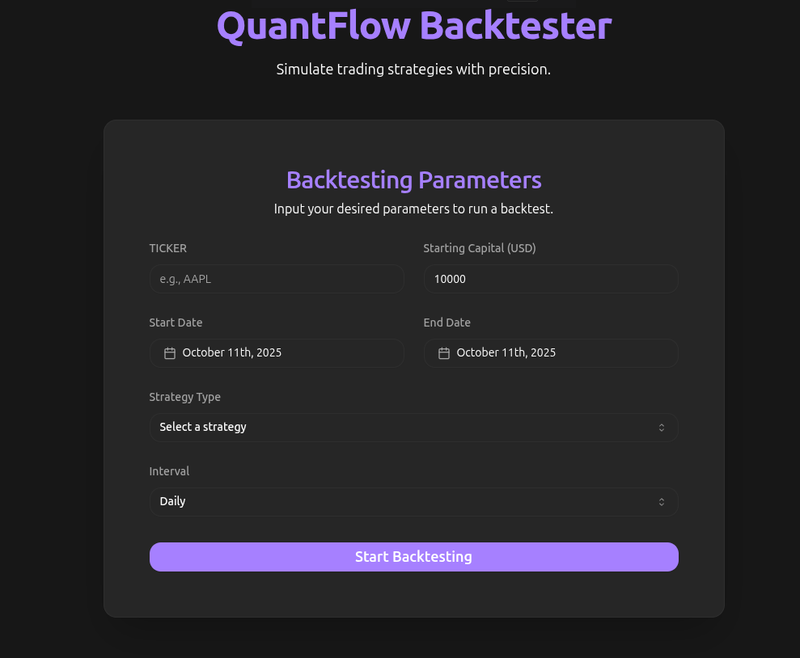
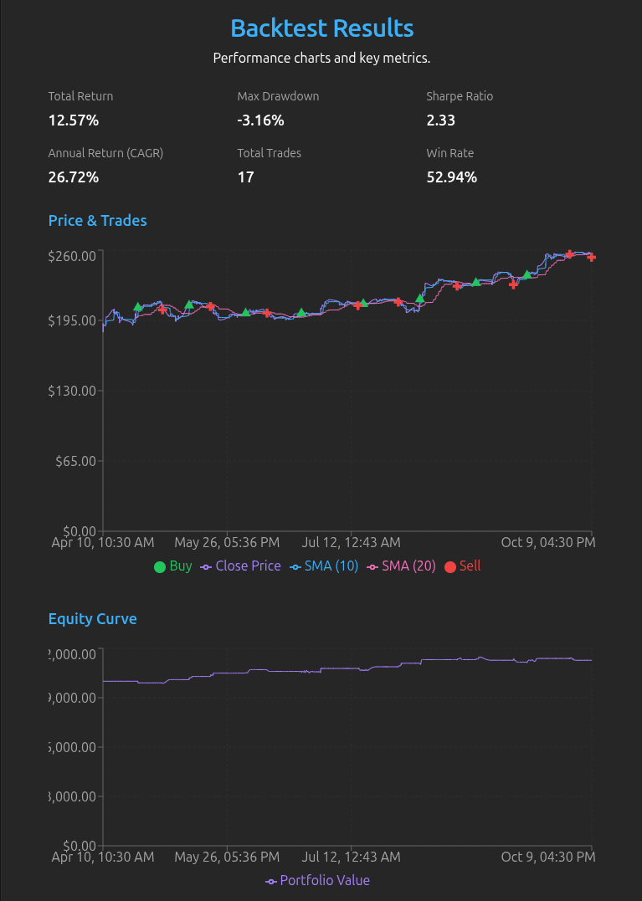

# Backtester Project

A Django-based Backtester with a Vite/React Frontend.

<p align="center">
  
</p>

## 📊 Overview

Perform complex backtesting simulations with ease. Visualize results with interactive charts.

<p align="center">
  
</p>

## 🚀 Deployment Guide (VPS with Docker)

This project is containerized with Docker for easy deployment. It includes:
-   **Backend**: Django (Gunicorn)
-   **Frontend**: Vite (Nginx)
-   **Database**: SQLite (Persisted via volume)
-   **Proxy**: Internal Nginx to route `/` to frontend and `/api`, `/admin` to backend.

### Prerequisites
-   Docker Engine installed.
-   Docker Compose (v2) installed.
-   (Optional) Nginx Proxy Manager installed on the host for SSL/Domain management.

### Installation Steps

1.  **Clone the Repository**:
    ```bash
    git clone <your-repo-url>
    cd backtest-dj
    ```

2.  **Configure Environment**:
    Create a `.env` file from the template:
    ```bash
    cp .env.example .env
    ```
    Open `.env` and **CHANGE** the following:
    -   `DJANGO_SECRET_KEY`: Set to a long random secure string.
    -   `DJANGO_ALLOWED_HOSTS`: Add your VPS IP / Domain.
    -   `DJANGO_CSRF_TRUSTED_ORIGINS`: Add your full URL (e.g., `https://app.yoursite.com`).

    ```bash
    nano .env
    ```

3.  **Start Services**:
    Build and run the containers:
    ```bash
    docker compose up --build -d
    ```

4.  **Initial Setup (First Run Only)**:
    You need to set up the database and create an admin user.
    ```bash
    # Run migrations
    docker compose exec backend python manage.py migrate

    # Create admin user (follow the interactive prompts)
    docker compose exec -it backend python manage.py createsuperuser
    ```

5.  **Access the Application**:
    -   **Frontend**: `http://<your-vps-ip>` (or your domain via Proxy Manager)
    -   **Admin Panel**: `http://<your-vps-ip>/admin/`
    -   **API**: `http://<your-vps-ip>/api/v1/backtest/`

### 🔒 Nginx Proxy Manager (SSL) Configuration

If you are using Nginx Proxy Manager:
1.  Ensure `docker-compose.yml` does not conflict on port 80. If needed, allow the project to bind to a different port (e.g., `8081:80`) in `docker-compose.yml`.
2.  In Proxy Manager, add a Proxy Host:
    -   **Domain**: `app.yoursite.com`
    -   **Forward Host**: `host.docker.internal` (or your VPS private IP)
    -   **Forward Port**: `80` (or `8081` if changed)
    -   **SSL**: Enable "Force SSL" and "HSTS".

### 🛠 Troubleshooting

-   **Updates**: To deploy code changes, run:
    ```bash
    git pull
    docker compose up --build -d
    ```

-   **Logs**: Check logs if something fails:
    ```bash
    docker compose logs -f
    ```
